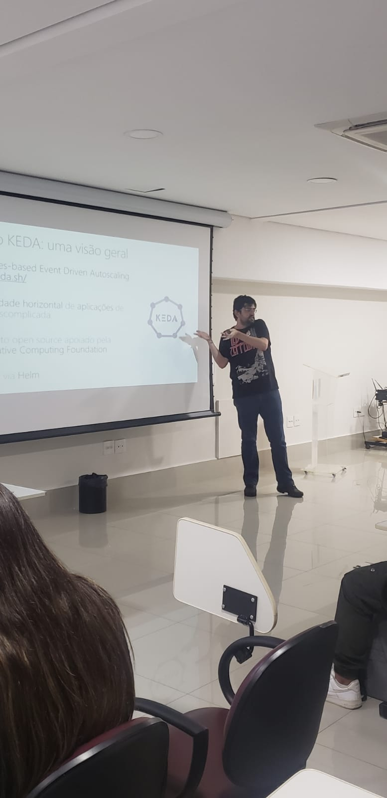

# Talk-Kubernetes-DevBrTechDay
Informações (dados gerais + prints) + slides sobre a apresentação que realizei durante o **DevBr Tech Day**, um evento realizado na cidade de **São Paulo-SP** no dia **15/04/2023**.

Título da Apresentação: **Kubernetes e Escalabilidade - criando aplicações para processar milhares (ou milhões) de acessos simultâneos!**

Tecnologias utilizadas: **Kubernetes, Azure Kubernetes Service, KEDA, Docker, Docker Hub, RabbitMQ, .NET 7, ASP.NET Core, k9s, Application Insights**

Número de participantes: **15 pessoas**

Local: **Instituto Monitor - Avenida Rangel Pestana, 1105 - Brás - São Paulo - SP**

Formulário utilizado para inscrições: [**Sympla**](https://www.sympla.com.br/evento/devbr-tech-day/1926584)

Deixo aqui meus agradecimentos à **Thamirys Gameiro (Microsoft MVP)** e ao **Angelo Belchior (Microsoft MVP)** por todo o apoio para que eu partipasse como palestrante do **DevBr Tech Day**.

---

